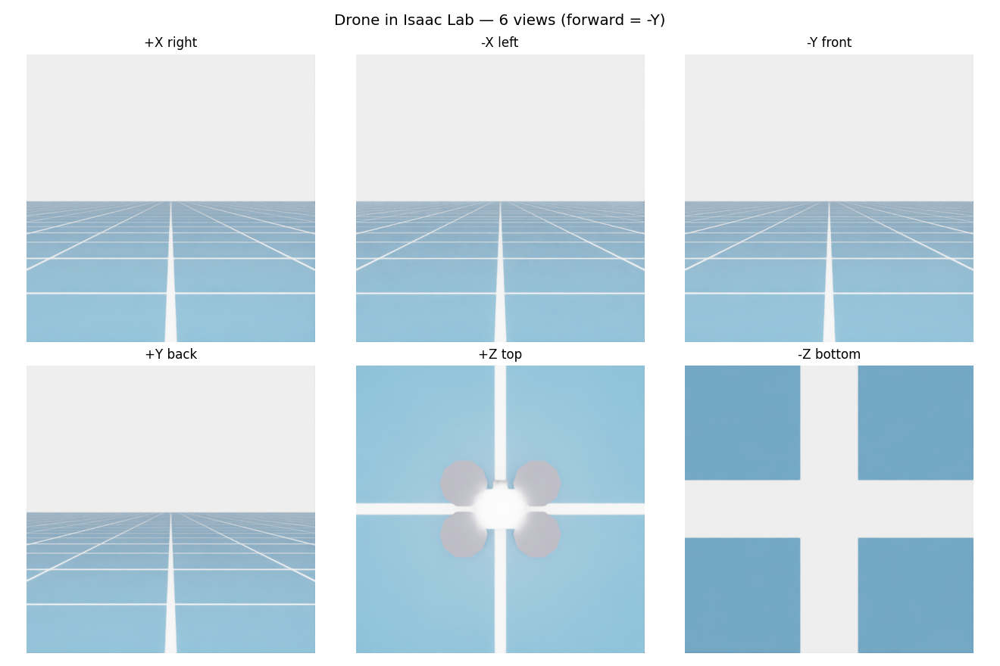

# starling2max-isaaclab

A small, reproducible **toolchain** for turning a multirotor CAD model into a
physics-ready **USD** for **NVIDIA Isaac Sim / Isaac Lab**, and functionally
testing it (cameras + ToF depth, hover, keyboard tele-op, collisions).

It was built while bringing a **ModalAI Starling 2 Max** (C29, with ToF) into
Isaac Lab, but the scripts are generic and work on any quad-shaped mesh.

> **⚠️ No proprietary geometry is included.** The Starling CAD is distributed by
> ModalAI under gated terms and is **not** redistributed here. This repo ships
> only the **scripts** (my own work) plus a **100%-original placeholder drone**
> so the pipeline runs out-of-the-box. Bring your own CAD for the real model —
> see *[Using your own CAD](#using-your-own-cad)*.

---

## Preview

*(Rendered from the original `demo_drone.usd` placeholder — no proprietary CAD.)*




Regenerate with `python make_media.py --usd demo_drone.usd`.

---

## What it does

```
 CAD (STEP)                         ── you export, see "Using your own CAD"
   │  (Fusion 360 / FreeCAD / Blender)
   ▼
 OBJ ── (Isaac Sim importer / usdcat) ─▶ raw USD (mm, Y-up, no physics)
   │
   ├─ fix_drone_usd.py        → *_fixed.usd     (meters, Z-up, correct scale)
   ├─ add_drone_physics.py    → *_physics.usd   (rigid body + box collider + mass)
   └─ add_drone_frames.py     → *.usd           (rotor + camera/ToF frames)
                                     │
                                     ▼
                        test_starling_functions.py
              (5 cameras + ToF depth, hover, keyboard tele-op, collisions)
```

No CAD? Generate the placeholder and run the whole thing:

```bash
python make_demo_drone.py --out demo_drone.usd
python test_starling_functions.py --usd demo_drone.usd --out demo_out
```

---

## Requirements

- **Isaac Sim / Isaac Lab 4.5+** (provides `isaacsim.*`, `pxr`, Replicator).
- Run every script with the Isaac Python (each script boots a headless
  `SimulationApp` before importing `pxr`, so a plain `python foo.py` inside the
  `env_isaaclab` env works).
- `matplotlib` / `Pillow` optional (nicer image saving; falls back gracefully).

---

## Scripts

| Script | Purpose |
|---|---|
| `test_drone_usd.py` | Inspect a USD: hierarchy, world bbox, **scale sanity check**, physics presence |
| `fix_drone_usd.py` | Fix units / up-axis (mm→m, Y-up→Z-up, `metersPerUnit=1`) → `*_fixed.usd` |
| `add_drone_physics.py` | Add a single rigid body + **box/hull/decomp** collider + mass → `*_physics.usd`; `--list-corners` finds rotor clusters |
| `locate_prim.py` | Report a mesh's **true world center** by name/path (pivots are baked to origin after CAD→OBJ→USD) |
| `add_drone_frames.py` | Add `rotor_0..3` (with `drone:spinDir`) + camera/ToF frames (with `drone:sensorType`/`drone:viewDir`), read from named meshes |
| `verify_physics.py` | Drop-test the asset onto a ground plane using its own physics |
| `test_starling_functions.py` | Functional test: 5 cameras + ToF depth, quad hover, keyboard tele-op, physical collisions |
| `make_demo_drone.py` | Generate the original placeholder quadrotor USD (no CAD needed) |
| `make_media.py` | Render the README media: 6-view contact sheet + flight GIF → `docs/` |

---

## Functional test controls

`test_starling_functions.py` starts the drone on the ground. In the viewport:

| Key | Action |
|---|---|
| **Page Up / Page Down** | take off / climb · descend / land |
| **↑ / ↓** | forward / back (forward = **−Y**) |
| **← / →** | strafe left / right |
| **Home** | reset upright on the ground |

> Do **not** use `Space` — it is Isaac Sim's play/pause and freezes the sim.

The controller is a standard cascaded **position + attitude geometric controller**
with **body-frame thrust**, so the drone must lean to translate and collisions
destabilize it physically (handled by PhysX) instead of being ignored.

---

## Using your own CAD

The scripts operate on geometry; they do not contain any. To use the real model:

1. **Obtain the CAD yourself** from the vendor under their terms (for Starling:
   ModalAI developer portal / forum).
2. **STEP → OBJ**: export in Fusion 360 / FreeCAD / Blender (keep it as a single
   assembly; note the units, usually mm).
3. **OBJ → USD**: use Isaac Sim's built-in importer, or `usdcat`, producing e.g.
   `drone.usd`.
4. Run the pipeline:
   ```bash
   python test_drone_usd.py      --usd drone.usd            # inspect (expect wrong scale/axis)
   python fix_drone_usd.py       --in  drone.usd  --out drone_fixed.usd
   python add_drone_physics.py   --in  drone_fixed.usd --out drone_physics.usd
   python add_drone_frames.py    --in  drone_physics.usd --out my_drone.usd \
       --rotor-meshes  <m0> <m1> <m2> <m3> \
       --front-meshes  <front_a> <front_b> --down-meshes <down_a> <down_b>
   python test_starling_functions.py --usd my_drone.usd
   ```
   Use `locate_prim.py --name <substr>` to find the mesh names/positions for the
   `--*-meshes` flags.

---

## Roadmap

- **v1 (this release)** — single-rigid-body USD + rotor/camera/ToF frames,
  geometric flight controller, keyboard tele-op, camera/ToF/collision tests.
- **v2 (planned)** — **articulated rotors**: split the 4 propellers into
  revolute-jointed bodies so they actually spin, with per-rotor thrust /
  aerodynamics (Articulation), matching Isaac Lab's quadcopter RL setup.

---

## License & attribution

- **Code** in this repository: [MIT](LICENSE).
- **Geometry / CAD** of any real vehicle (e.g. ModalAI Starling): **not
  included and not licensed here** — it belongs to its owner and is subject to
  the terms under which you obtained it. Do not commit vendor CAD to this repo
  (`.gitignore` blocks the common formats).
- Not affiliated with or endorsed by ModalAI.
